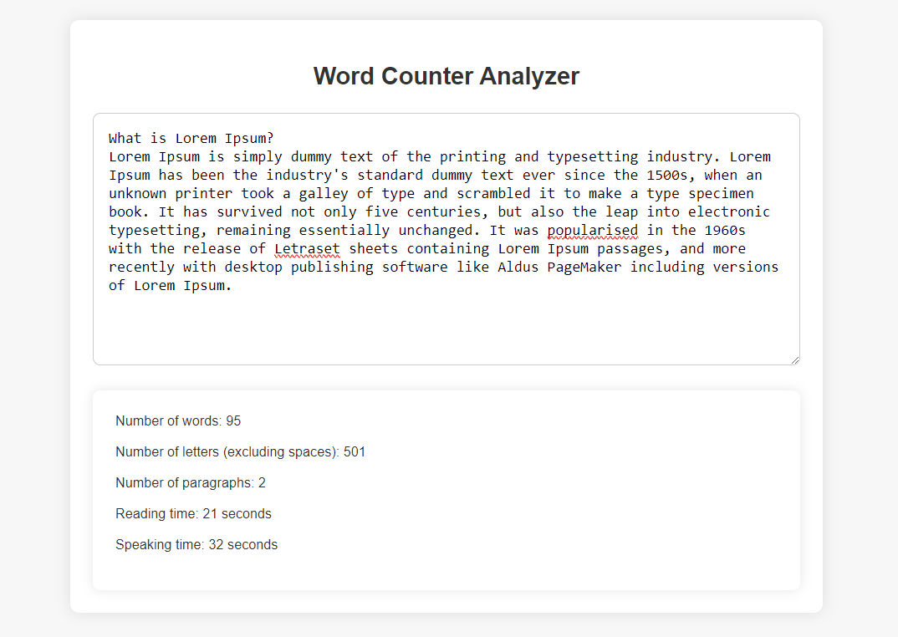

<p align="center">
<a href="https://github.com/0xelsherif/Word-Counter-Analyzer"></a>
<a href="https://github.com/0xelsherif/Word-Counter-Analyzer"></a>
<a href="https://github.com/0xelsherif/Word-Counter-Analyzer"></a>
<a href="https://github.com/0xelsherif/Word-Counter-Analyzer/discussions"></a>
<a href="https://github.com/0xelsherif/Word-Counter-Analyzer/issues"></a>
<a href="https://twitter.com/intent/follow?screen_name=0xelsherif"></a>
<a href="https://codepen.io/0xelsherif/full/dyLJWRd" target="_blank"></a>
</p>

# Word Counter Analyzer

Word Counter Analyzer project is a simple yet useful tool developed using JavaScript. It provides users with the ability to analyze text input by calculating various metrics such as word count, letter count, reading time, speaking time, and paragraph count. This project is designed to be integrated into any HTML document with a textarea element, making it versatile and easily accessible.

## Usage

1. Input your text in the textarea provided.
2. The script will automatically update the counts and times as you type or edit the text.

## Features

- **Word Count:** Calculate the total number of words in the input text.
- **Letter Count:** Calculate the total number of letters excluding spaces.
- **Paragraph Count:** Determine the number of paragraphs based on newline characters.
- **Reading Time:** Estimate the time it takes to read the text based on an average reading speed of 275 words per minute.
- **Speaking Time:** Estimate the time it takes to speak the text based on an average speaking speed of 180 words per minute.
- **Real-time Update:** Automatically update counts and times as the user types or edits the text.
- **Customizable:** Easily integrate into any HTML document with a textarea element.
- **No Dependencies:** No external libraries required for the script to function.
- **Cross-browser Compatibility:** Compatible with modern web browsers that support JavaScript.

## Function Explanation

The `updateWordCount` function performs the following tasks:

- Retrieves the text from the textarea and removes leading/trailing whitespace.
- Calculates the word count by splitting the text into words, filtering out empty strings, and counting the number of words.
- Counts the number of letters (excluding spaces).
- Determines the paragraph count based on the number of newline characters.
- Calculates reading time based on an average reading speed of 275 words per minute.
- Calculates speaking time based on an average speaking speed of 180 words per minute.
- Formats the time as hours, minutes, and seconds.
- Updates the HTML content of the result div with the calculated values.

## Example Output



## Dependencies

This script does not require any external libraries and can be integrated into any HTML document with a textarea element.

## Compatibility

The script is compatible with modern web browsers that support JavaScript.

## How It Works

The function listens to the input event on the textarea element, triggering the `updateWordCount` function whenever the user types or edits the text. The function then calculates various metrics based on the text content and updates the result div accordingly.

## How to Run

### Option 1: Download ZIP

1. Download the ZIP file from the [GitHub repository](https://github.com/0xelsherif/Word-Counter-Analyzer).
2. Extract the ZIP file to your desired location.
3. Open the extracted folder.
4. Double-click the `index.html` file to open it in a web browser.

### Option 2: Clone the Repository

1. Clone the repository using the following command in your terminal or command prompt:
``` 
git clone https://github.com/0xelsherif/Word-Counter-Analyzer.git 
```
2. Navigate to the cloned directory:
``` 
cd Word-Counter-Analyzer
```
3. Open the `index.html` file in a web browser.

## Support and Contributions

If you find this project useful or interesting, consider giving it a star ⭐ on GitHub and spreading the word! Your support means a lot to me and helps in maintaining and improving the project.

If you'd like to contribute to the project, whether it's fixing bugs, adding new features, or improving documentation, feel free to open a pull request. Contributions of all kinds are welcome!

## Follow Me

Follow me on GitHub to stay updated with my latest projects and contributions:

[](https://github.com/0xelsherif)

### Buy Me a Coffee ☕

If you'd like to support the development of this project further or express your appreciation with a small gesture, consider buying me a coffee! Your support helps keep me fueled for more coding sessions. Thank you for your support! 

[](https://www.buymeacoffee.com/0xelsherif)
